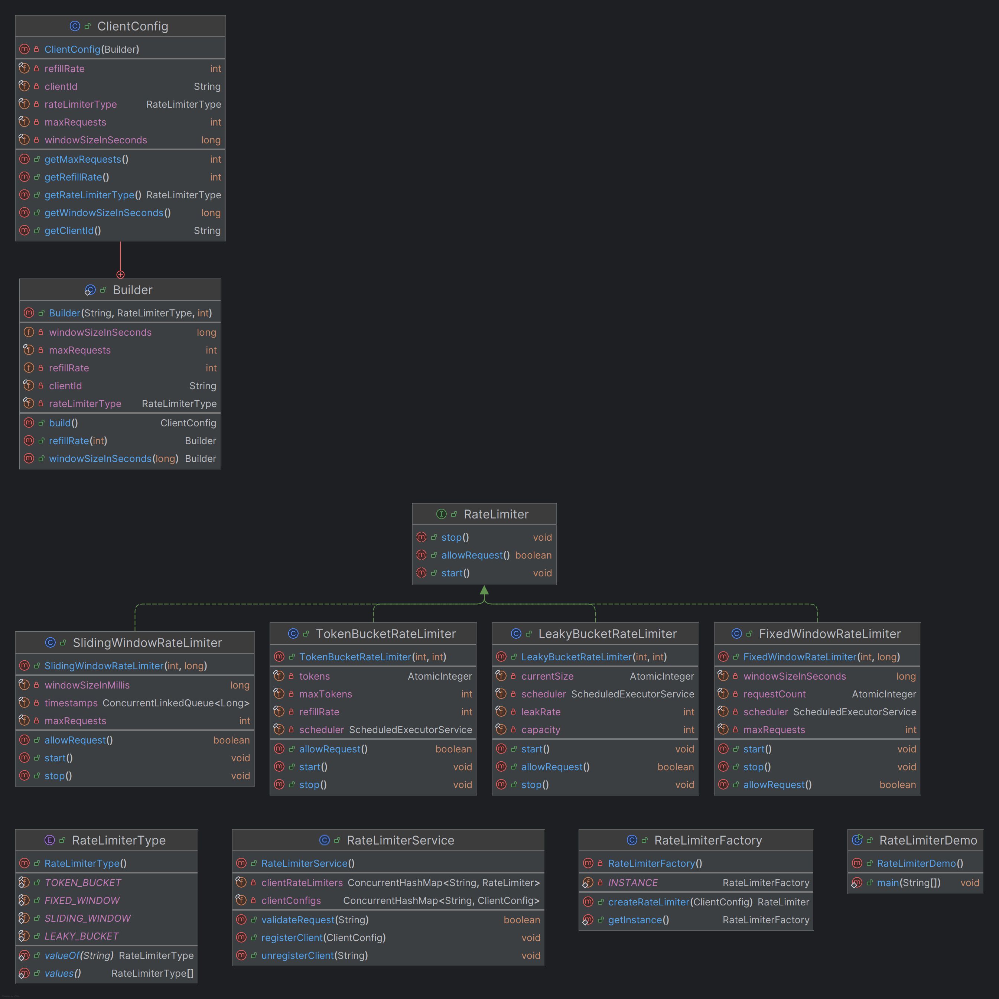

# lld-ratelimiter

## why

1. protect system resources.
2. provides fair usage among users
3. prevent DDOS (denial of service)

---

## requirements

1. scalable and extensible solution.
2. supports various algorithm.
    1. token bucket
        - The Token Bucket algorithm is one of the most widely used rate-limiting strategies due to its flexibility and
          efficiency in handling bursty traffic patterns. It allows a certain amount of flexibility in the rate at which
          requests are processed, making it suitable for scenarios where occasional bursts of traffic are expected.
    2. leaky bucket
        - The Leaky Bucket algorithm ensures that requests are processed at a constant rate, regardless of the
          burstiness of incoming requests. It uses a queue-like structure where incoming requests are added to the
          bucket and are processed at a fixed leak rate.
    3. fixed window
        - The Fixed Window Counter algorithm divides time into fixed intervals (windows) and counts the number of
          requests within each window. If the count exceeds the limit within the window, subsequent requests are
          rejected until the next window starts.
    4. sliding window
        - The Sliding Window algorithm provides a more granular control compared to Fixed Window by maintaining a
          sliding window of time and allowing requests based on the number within that window.

---

### Adherence to OOP and SOLID Principles

**Single Responsibility**:

- Each rate limiter class handles its own algorithm without overlapping concerns.

**Open/Closed Principle**:

- New rate limiter algorithms can be added by implementing the `RateLimiter` interface and updating the
  `RateLimiterFactory` without modifying existing classes.

**Liskov Substitution Principle**:

- All rate limiter implementations can be substituted where `RateLimiter` is expected.

**Interface Segregation Principle**:

- The `RateLimiter` interface is minimal and specific to rate limiting functionality.

**Dependency Inversion Principle**:

- High-level modules (`RateLimiterService`) depend on abstractions (`RateLimiter`) rather than concrete implementations.

### Extensibility

**Adding New Algorithms**:

- To add a new rate limiting algorithm, create a new class implementing `RateLimiter`, update the `RateLimiterType`
  enum, and modify the `RateLimiterFactory` to handle the new type.

**Client-Specific Configurations**:

- The `ClientConfig` class with the `Builder` pattern allows for flexible and clear client-specific configurations.

### Concurrency Handling

**Thread Safety**:

- Utilizes `ConcurrentHashMap`, `AtomicInteger`, and thread-safe queues (`ConcurrentLinkedQueue`) to manage state across
  multiple threads.

- **Scheduled Tasks**:
- Uses `ScheduledExecutorService` to handle periodic tasks like _token refills_ and _window resets_ without blocking
  request processing.

---

## class diagram

---

| **Algorithm**            | **Usages**                                                                                                               | **Pros**                                                                                                                                                                                                      | **Cons**                                                                                                                                                                                                                                                  |
|--------------------------|--------------------------------------------------------------------------------------------------------------------------|---------------------------------------------------------------------------------------------------------------------------------------------------------------------------------------------------------------|-----------------------------------------------------------------------------------------------------------------------------------------------------------------------------------------------------------------------------------------------------------|
| **Token Bucket**         | - API rate limiting - Network traffic shaping - Resource allocation in multi-user systems                          | - **Flexibility**: Allows bursts of traffic up to the bucket's capacity. - **Smooth Rate Control**: Maintains an average rate over time. - **Simple Implementation**: Easy to understand and implement. | - **Memory Overhead**: Requires maintaining a token count. - **Potential for Burst Abuse**: If not properly configured, large bursts can overwhelm the system.                                                                                         |
| **Leaky Bucket**         | - Network packet rate regulation - Ensuring a steady output rate - Controlling data flow in streaming applications | - **Consistent Output Rate**: Processes requests at a fixed rate, smoothing out traffic. - **Prevents Burstiness**: Limits sudden spikes in traffic.                                                       | - **Less Flexible**: Does not allow bursts beyond the leak rate. - **Potential Latency**: Requests may be delayed if the bucket is full.                                                                                                               |
| **Fixed Window Counter** | - Simple API rate limiting - Monitoring request counts within fixed time intervals                                    | - **Simplicity**: Easy to implement and understand. - **Low Overhead**: Minimal state management.                                                                                                          | - **Edge Effects**: Can allow double the rate limit during window transitions. - **Inefficient for Bursty Traffic**: Does not handle spikes gracefully.                                                                                                |
| **Sliding Window**       | - Advanced API rate limiting - Applications requiring precise rate control - Real-time analytics                   | - **Accuracy**: Provides a more precise rate limit by considering the exact time of each request. - **Better Burst Handling**: Allows bursts within the sliding window.                                    | - **Complexity**: More complicated to implement compared to fixed window. - **Higher Memory Usage**: Needs to store timestamps of requests. - **Performance Overhead**: Can be less efficient under high load due to frequent timestamp management. |

---

### **Choosing the Right Algorithm**

- **Token Bucket** is ideal when you need flexibility to handle bursts while maintaining an average rate over time. It's
  suitable for API rate limiting where occasional spikes are expected.

- **Leaky Bucket** is preferable when you require a consistent output rate, such as in network packet rate regulation,
  ensuring smooth data flow.

- **Fixed Window Counter** is best for simple scenarios where implementation simplicity and low overhead are priorities,
  and occasional edge case abuses are acceptable.

- **Sliding Window** is the choice for applications requiring precise and accurate rate limiting without the drawbacks
  of fixed window transitions, despite its increased complexity and resource usage.

---
